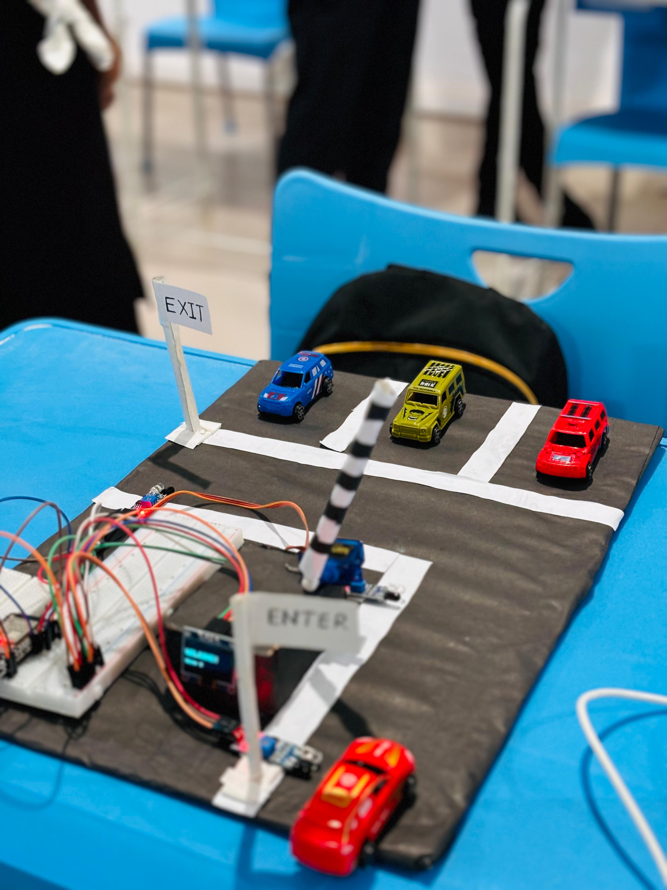

# Automatic Smart Car Parking System

##  Prototype

##  Overview
The Automatic Smart Car Parking System is an IoT-based embedded systems project developed using an ESP32 microcontroller. The system automatically detects vehicle availability, controls the parking gate using a servo motor, and displays parking status on an OLED display.

##  Features
- Automatic vehicle detection using IR sensors
- Automatic gate control using a Servo Motor (SG90)
- OLED display for parking status
- Low-cost and energy-efficient design
- Suitable for smart parking applications

##  Components Used
- ESP32 Development Board
- Servo Motor (SG90)
- OLED Display
- Breadboard
- Jumper Wires

##  Software Used
- Arduino IDE

##  Learning Outcomes
- Embedded Systems
- Microcontroller Programming
- Sensor Integration
- IoT Fundamentals
- Automation and Control Systems

##  Future Improvements
- RFID-based vehicle access control using the RC522 RFID module
- Mobile App Integration
- Cloud-Based Monitoring
- Parking Reservation System
- Number Plate Recognition

##  Author
**Ishara Sewmini**  
Faculty of Applied Sciences  
Wayamba University of Sri Lanka
